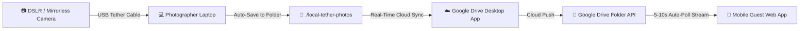

# 💍 Sri Lakshmi & Sai Teja - Real-Time Wedding Photo Gallery

A luxury, mobile-first, real-time wedding photo gallery application designed for luxury wedding receptions. Built with **React**, **Vite**, **TailwindCSS**, and the **Google Drive v3 API**.

---

## 🏗️ System Architecture & Automated Offline-to-Cloud Pipeline



### Flow Breakdown:
1. **Camera-to-Laptop (Offline)**: Photographer shoots photos in Medium JPEG format tethered via USB-C data cable. Brand tethering software (Sony Imaging Edge / Canon EOS Utility / Nikon NX Tether) dumps new shots instantly into `./local-tether-photos`.
2. **Sync Bridge**: The official **Google Drive for Desktop** application mirrors the `./local-tether-photos` folder in real-time into a specific Google Drive Cloud Folder ID.
3. **Web Gallery (This Codebase)**: Queries the Google Drive v3 API (`https://googleapis.com/drive/v3/files`) every 7 seconds for newly created image files, prepending them to the Pinterest-style masonry grid without forcing guests to refresh their browsers.

---

## 🌟 Key Features

- ⚜️ **Luxury Dark & Gold Design**: Obsidian background (`#0A0A0C`), Champagne Gold accents (`#D4AF37`), Cinzel Serif & Montserrat typography, and glassmorphism.
- 📱 **Mobile-First Masonry Grid**: Pinterest-style fluid responsive grid layout with smooth entry animations for newly tethered photos.
- ⚡ **Optimized Loading & High-Res Downloads**: Displays fast upscaled thumbnail previews (`=w1200`), with an overlay button mapping directly to uncompressed source downloads.
- 🔄 **Live State Synchronization**: Auto-polls Google Drive API every 5–10s, triggering a celebratory toast banner when new photos arrive.
- 🔍 **Full-Screen Lightbox**: Pinch/zoom support, photo metadata (capture time, dimensions, uncompressed file size), direct high-res download, and social share link.
- 📱 **Venue QR Code Generator**: Built-in modal generating a printable QR code so guests at the reception desk can point their smartphones to open the live gallery.
- 🎬 **Presentation Slideshow Mode**: Full-screen ambient crossfade mode for display TVs or projector screens at the wedding venue.
- 🧪 **Instant Mock/Demo Mode**: Ships with built-in high-res sample wedding photos so you can preview and test the web app immediately without waiting for API keys.

---

## 🛠️ Step-by-Step Setup Guide

### 1. Google Cloud API Key Setup
1. Go to the [Google Cloud Console](https://console.cloud.google.com/).
2. Create a new project named **`wedding-photo-gallery`**.
3. In the left navigation menu, go to **APIs & Services > Library**.
4. Search for **Google Drive API** and click **Enable**.
5. Go to **APIs & Services > Credentials**.
6. Click **+ Create Credentials > API Key**.
7. Copy the generated API Key string.
8. *(Optional)* Click **Edit API key** to set Application restrictions (e.g., HTTP Referrers or restrict key usage strictly to Google Drive API).

### 2. Extract Google Drive Folder ID
1. Open [Google Drive](https://drive.google.com/) in your browser.
2. Create a folder named `Srilu_Ganesh_Wedding_Live`.
3. Right-click the folder > **Share** > set Access to **"Anyone with the link can view"**.
4. Open the folder and check your browser URL bar:
   `https://drive.google.com/drive/folders/1A2b3C4d5E6f7G8h9I0jK_LMN`
5. The string after `/folders/` (`1A2b3C4d5E6f7G8h9I0jK_LMN`) is your **`GOOGLE_DRIVE_FOLDER_ID`**.

### 3. Camera Tethering & Local Laptop Sync Setup
1. Connect your DSLR/Mirrorless camera to your laptop via USB.
2. Launch your camera software (e.g., Sony Imaging Edge Remote, Canon EOS Utility, Lightroom Tether).
3. Set the destination directory to `./local-tether-photos`.
4. Install **Google Drive for Desktop**.
5. Add `./local-tether-photos` to Google Drive Sync so it uploads directly to your target folder.

---

## 🚀 Environment & Local Execution

### Environment Variables
Copy `.env.example` to `.env`:
```bash
cp .env.example .env
```

Edit `.env`:
```env
VITE_GOOGLE_DEVELOPER_API_KEY=your_google_cloud_api_key_here
VITE_GOOGLE_DRIVE_FOLDER_ID=your_google_drive_folder_id_here
VITE_POLL_INTERVAL_MS=7000
VITE_USE_MOCK_DATA=false
```

### Install & Start Local Dev Server
```bash
# Install dependencies
npm install

# Run Vite local development server
npm run dev
```

Open `http://localhost:5173` in your browser.

### Build Production Bundle
```bash
npm run build
```

---

## 🎨 Tech Stack Summary

- **Frontend**: React 18, Vite
- **Styling**: Tailwind CSS v4, Vanilla CSS Design System, Glassmorphic UI
- **Typography**: Google Fonts (Cinzel, Montserrat)
- **Icons**: Lucide React
- **API**: Google Drive v3 REST API (`https://www.googleapis.com/drive/v3/files`)
- **QR Generator**: `qrcode`
- **Celebration Effects**: `canvas-confetti`
